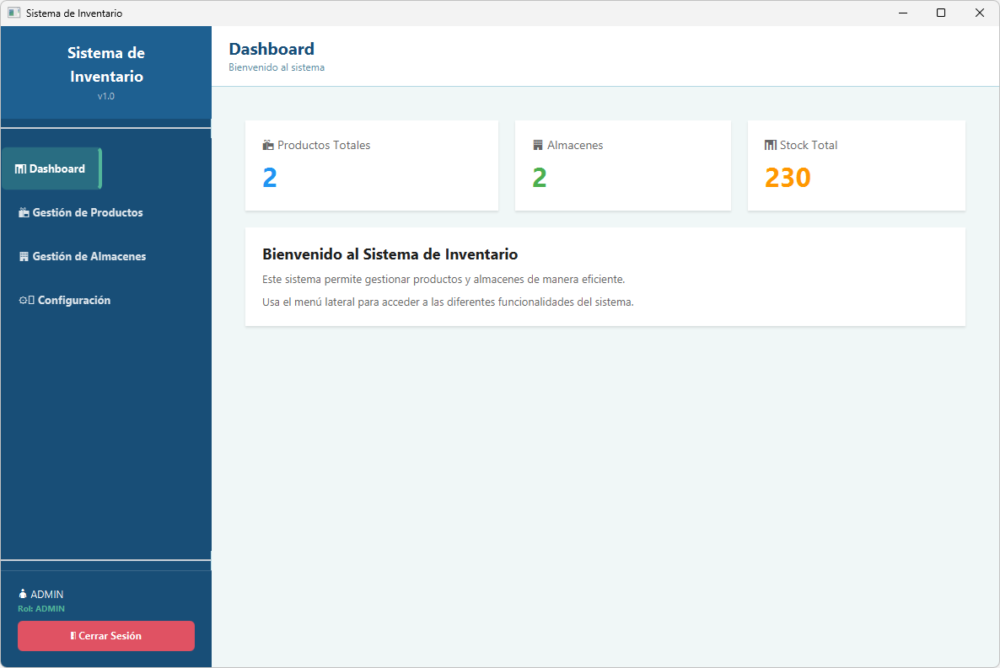
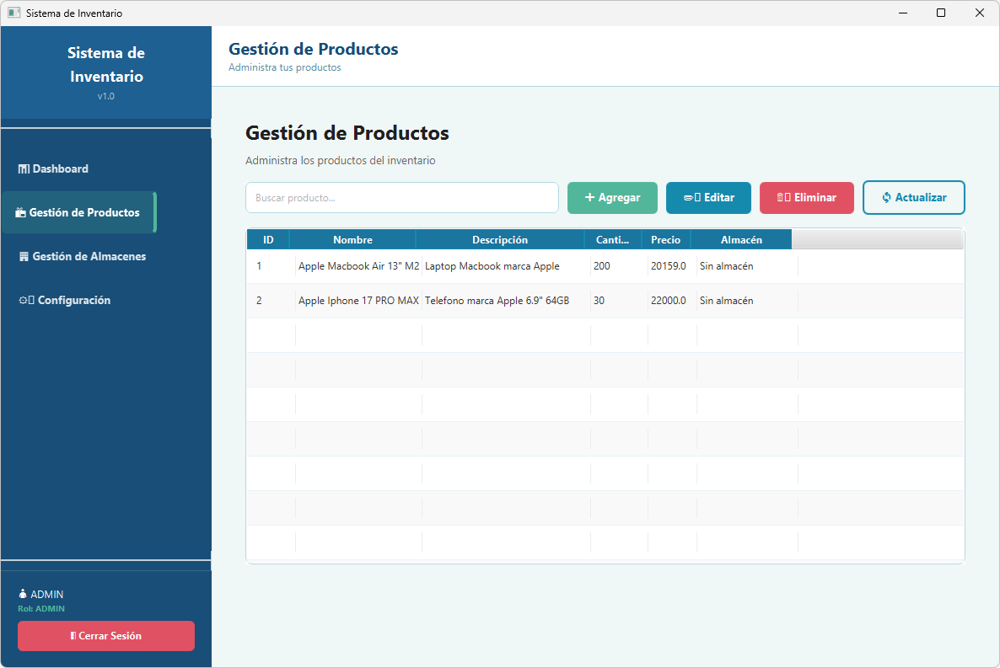
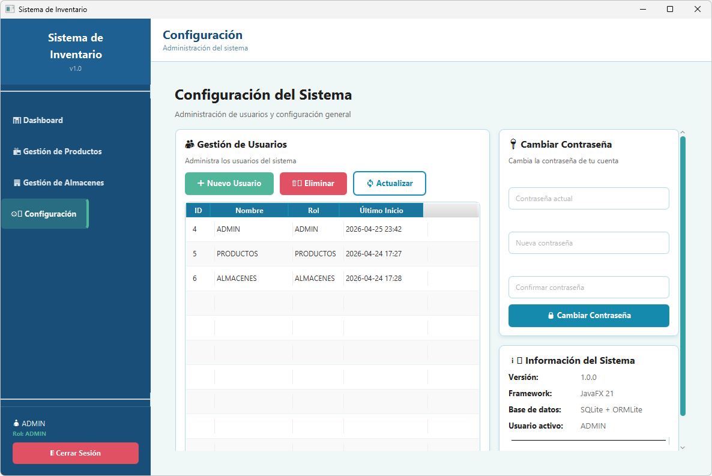

# Sistema de Inventario

## Sobre el desarrollo
Este proyecto fue desarrollado con apoyo de herramientas de IA (GitHub Copilot y Claude) 
para evaluar su capacidad de asistir en la construcción, refactorización y documentación 
de proyectos de software reales.

## Tecnologías utilizadas

- **Java 21**
- **JavaFX 21** — Interfaz gráfica
- **ORMLite 6.1** — ORM para manejo de base de datos
- **SQLite** — Base de datos embebida
- **BCrypt** — Encriptación de contraseñas
- **JUnit 5** — Pruebas unitarias
- **Maven** — Gestión de dependencias

## Arquitectura del proyecto

El proyecto sigue el patrón MVC (Modelo-Vista-Controlador), donde los modelos 
representan las entidades del sistema, las vistas se definen en archivos FXML 
y los controladores gestionan la lógica de la interfaz. Adicionalmente, la 
persistencia de datos se abstrae en una capa independiente mediante ORMLite 
y el patrón DAO.
```
src/main/java/mx/unison/
├── Main.java                  
├── Launcher.java              
├── models/                    
│   ├── Producto.java
│   ├── Almacen.java
│   └── Usuario.java
├── database/                  
│   ├── DatabaseManager.java
│   └── dao/
│       ├── ProductoDao.java
│       ├── AlmacenDao.java
│       └── UsuarioDao.java
├── controllers/               
│   ├── MainController.java
│   ├── LoginController.java
│   ├── MainViewController.java
│   ├── ProductosViewController.java
│   ├── ProductoFormController.java
│   ├── AlmacenesViewController.java
│   ├── AlmacenFormController.java
│   └── ConfigViewController.java
├── service/                   
│   └── AuthService.java                      
├── util/
│   ├── CryptoUtils.java
│   └── UIUtils.java
src/main/resources/
├── views/                     
│   ├── login.fxml
│   ├── main.fxml
│   ├── productos.fxml
│   ├── formProducto.fxml
│   ├── almacenes.fxml
│   ├── formAlmacen.fxml
│   └── config.fxml
├── styles/                    
│   ├── styles.css
│   └── navigation.css
└── img/                    
    └── escudo_unison.png
```

## Mejoras respecto a la versión anterior

### Interfaz de usuario
- Migración completa de Java Swing a JavaFX
- Diseño moderno con paleta de colores oceánica
- Separación de vistas (FXML) y estilos (CSS)
- Sistema de navegación con sidebar y topbar
- Formularios modales para crear y editar registros

### Manejo de datos
- Implementación de ORMLite como ORM, eliminando consultas SQL directas
- Patrón DAO para centralizar el acceso a los datos
- Gestión centralizada de la base de datos con `DatabaseManager`
- Relaciones entre entidades mediante anotaciones ORMLite

### Seguridad
- Reemplazo de MD5 por BCrypt para el almacenamiento de contraseñas
- Prevención de inyección SQL mediante consultas parametrizadas de ORMLite
- Sistema de roles con control de acceso por módulo (ADMIN, PRODUCTOS, ALMACENES)

### Controladores
- Separación completa de la lógica de negocio y la interfaz de usuario
- Jerarquía de controladores con responsabilidades bien definidas
- Servicio de autenticación dedicado (`AuthService`)

## Instalación y ejecución

### Requisitos
- Java 21 o superior
- Maven 3.6 o superior

### Pasos

1. Clona el repositorio:
```bash
git clone https://github.com/pablo22a/sistema-inventario-javafx.git
```

2. Entra al directorio del proyecto:
```bash
cd sistema-inventario-javafx
```

3. Compila el proyecto:
```bash
mvn compile
```

4. Ejecuta la aplicación:
```bash
mvn javafx:run
```

### Ejecución en IntelliJ IDEA

1. Clona o descarga el repositorio y ábrelo en IntelliJ IDEA con 
   `File` → `Open`
2. IntelliJ detectará automáticamente el proyecto Maven y descargará 
   las dependencias
3. Configura el JDK 21 en `File` → `Project Structure` → `Project`
4. En la ventana de Maven (panel derecho) ve a 
   `Plugins` → `javafx` → `javafx:run`
5. Haz doble clic en `javafx:run` para ejecutar la aplicación

> **Nota:** No ejecutes la aplicación directamente desde `Main.java`. 
> Usa siempre `javafx:run` o ejecuta la clase `Launcher.java` desde 
> el botón de Run de IntelliJ.

## Credenciales de prueba

| Usuario | Contraseña | Rol |
|---------|-----------|-----|
| ADMIN | admin23 | Administrador |
| PRODUCTOS | productos19 | Gestión de productos |
| ALMACENES | almacenes11 | Gestión de almacenes |

## Capturas de pantalla

### Login


### Dashboard


### Gestión de Productos


### Gestión de Almacenes


### Configuración


## Pruebas

El proyecto cuenta con 68 casos de prueba entre pruebas unitarias y de integración. 
Para ejecutarlas:

```bash
mvn test
```

O directamente desde las clases de prueba en el IDE.

## Documentación

La documentación JavaDoc generada en HTML se encuentra en la carpeta `docs/javadoc/`.

## Estructura de la base de datos

La base de datos SQLite se genera automáticamente al iniciar la aplicación con las siguientes tablas:

- **usuarios** - Almacena los usuarios del sistema con su rol y contraseña encriptada
- **almacenes** - Almacena los almacenes con su nombre, ubicación y auditoría
- **productos** - Almacena los productos con su precio, cantidad y relación al almacén

## Materia

Gestión de la Calidad del Software II — Universidad de Sonora

